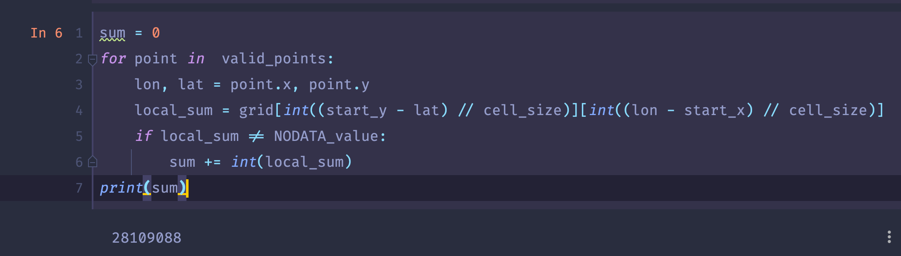
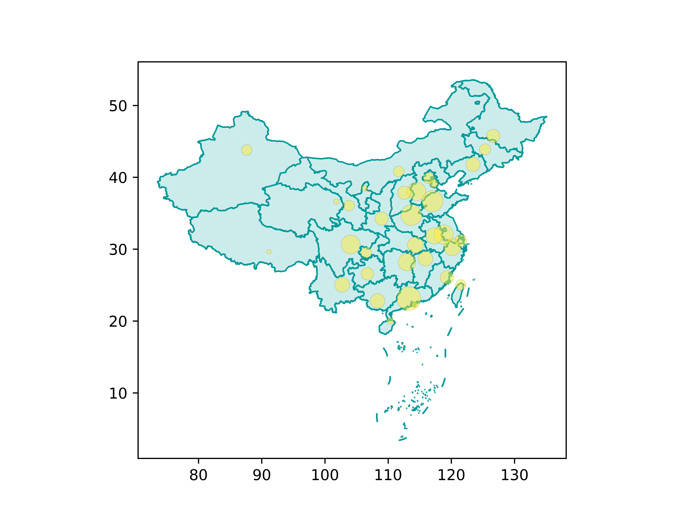

# Python程序设计\-大作业

班级：2019211308

学号：2019211504

姓名：王乾凱

## 数据处理

### 依赖包

* pandas
* numpy
* shapely
* json

### 处理思路

#### 处理源文件至程序中

以下思路的灵感来源于python是一门解释型语言，可以编译部分代码后继续运行，这样对于大数据文件来说可以先处理进程序中，再进行后续测试，避免了大量的io造成时间上的浪费。

环境：jupyter notebook

首先使用`pd.read_csv()`进行读取（最开始使用的是`np.loadtxt()`但是运行效率实在过低），再转换为numpy，参数如下

```python
grid_part = pd.read_csv(filepath,header=None,na_filter=False,delim_whitespace=True, skiprows=6).to_numpy()
```

随后遍历8个文件使用`np.concatenate`进行合并。最后就可以得到一个整合好的文件，处理过程中运行内存一度跑到23G。

#### 处理多边形包含的网格

参考stackoverflow上的issue[https://stackoverflow.com/questions/66010964/fastest-way-to-produce-a-grid-of-points-that-fall-within-a-polygon-or-shape](https://stackoverflow.com/questions/66010964/fastest-way-to-produce-a-grid-of-points-that-fall-within-a-polygon-or-shape)

首先读取geojson，这里为了可以验证测试数据的真实性，我下载了北京市的[geojson](poi86.com/poi/download_area_geojson/110000.html)数据进行了测试。

随后参考上述issue，使用`shapely`包把json文件读取为`polygon`对象，随后处理成`prep`（用于加速），获取到bound后遍历范围内坐标，并使用`filter`进行筛选。

```python
with open("1.geojson") as gj:
    gjson = json.load(gj)

polygon = shape(gjson['features'][0]['geometry'])
(latmin, lonmin, latmax, lonmax) =((x // cell_size * cell_size) for x in polygon.bounds)
prep_polygon = prep(polygon)
points = []
for lat in np.arange(latmin, latmax, cell_size):
    for lon in np.arange(lonmin, lonmax, cell_size):
        points.append(Point((round(lat,4), round(lon,4))))
valid_points = []
valid_points.extend(filter(prep_polygon.contains, points))
# print(valid_points)
```

最后北京市的人口测试出来的数据为28109088，与2018年统计的2100万人接近。



## 服务端

### 依赖包

* sanic

### 服务端结构

这里我采用了接口的mvc模式设计，controller层就是sainc作为框架的接口服务，而model层则是把上述数据处理的模块移植过来，即代码中的`class Dao`。

### 接口说明

1. `post /data`

   request中包含了geojson中对多边形完整的描述。返回值类型为json，只有一对记录，键值为sum，记录值为该多边形内人口总数。

### 服务端代码

```python
from sanic import Sanic
from sanic.response import json
from shapely.geometry import shape, Point
import numpy as np
import pandas as pd
from shapely.prepared import prep

app = Sanic("server")

class Dao:
    def __init__(self):
        self.cell_size = 0.0083333333333333
        self.NODATA_value = -9999
        self.start_x = -180
        self.start_y = 90
        filepath_base = "gpw-v4-population-count-rev11_2020_30_sec_asc/gpw_v4_population_count_rev11_2020_30_sec_"
        self.grid = None
        for col in range(2):
            grid_line = None
            for row in range(4):
                filepath = filepath_base + str(col * 4 + row + 1) + ".asc"
                # grid_part = np.loadtxt(filepath, skiprows=6)
                grid_part = pd.read_csv(filepath,header=None,na_filter=False,delim_whitespace=True, skiprows=6).to_numpy()
                if grid_line is None:
                    grid_line = grid_part
                else:
                    grid_line = np.concatenate((grid_line, grid_part), axis=1)
            if self.grid is None:
                self.grid = grid_line
            else :
                self.grid = np.concatenate((self.grid, grid_line), axis=0) 
        pass

    def validate_grid(self, gjson):
        polygon = shape(gjson['geometry'])
        (latmin, lonmin, latmax, lonmax) =((x // self.cell_size * self.cell_size) for x in polygon.bounds)
        prep_polygon = prep(polygon)
        points = []
        for lat in np.arange(latmin, latmax, self.cell_size):
            for lon in np.arange(lonmin, lonmax, self.cell_size):
                points.append(Point((round(lat,4), round(lon,4))))
        valid_points = []
        valid_points.extend(filter(prep_polygon.contains, points))
        sum = 0
        for point in  valid_points:
            lon, lat = point.x, point.y
            local_sum = self.grid[int((self.start_y - lat) // self.cell_size)][int((lon - self.start_x) // self.cell_size)]
            if local_sum != self.NODATA_value:
                sum += int(local_sum)
        return sum

dao = Dao()

@app.post("/data")
async def dataHandler(request):
    geo = request.json
    return json({'sum': dao.validate_grid(geo)})


if __name__ == '__main__':
    app.run(host='0.0.0.0', port=1337)
```


## 客户端


### 依赖包

* aiohttp
* asyncio
* json
* matplotlib
* geopandas

### 设计思路

因为老师没有在这方面规定的很明确，所以我在客户端上的方案是使用全国的数据，发到服务端求出每一个省的人口总数，随后绘图。

### 数据来源

1. https://data.jianshukeji.com/jsonp?filename=geochina/china.json
2. https://github.com/lyhmyd1211/GeoMapData_CN

### 效果预览



### 客户端代码

```python
from matplotlib import colors, pyplot as plt
import aiohttp
import asyncio
import json
import geopandas as gpd
    
    
async def main():
    async with aiohttp.ClientSession('http://127.0.0.1:1337') as session:
        with open("jsonp.json") as gj:
            gjson = json.load(gj)
        df_places = gpd.read_file('jsonp.json')
        df_places2 = gpd.read_file('jsonp1.json')
        cn_map = df_places.plot(fc="#CCEBEB",ec="#009999",lw=1)
        for item, (index, row), (index2, row2)in zip(gjson.get('features'), df_places.iterrows(), df_places2.iterrows()):
            if index2 != index:
                break;
            async with session.post('/data', json=item) as response:
                sum_raw = await response.json()
                sum = sum_raw.get('sum')
            cn_map.scatter(row2['longitude'], row2['latitude'], s=sum / 500000, color='#FFEB3B',alpha=.5,ec='k',lw=.1)
        
        plt.savefig("1.png", dpi=1000)
    

loop = asyncio.get_event_loop()
loop.run_until_complete(main())
```

