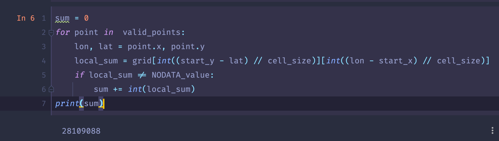

# Python程序设计\-大作业

班级：2019211308

学号：2019211504

姓名：王乾凱

## 数据处理

### 依赖包

* pandas
* numpy
* shapely
* json

### 处理思路

#### 处理源文件至程序中

以下思路的灵感来源于python是一门解释型语言，可以编译部分代码后继续运行，这样对于大数据文件来说可以先处理进程序中，再进行后续测试，避免了大量的io造成时间上的浪费。

环境：jupyter notebook

首先使用`pd.read_csv()`进行读取（最开始使用的是`np.loadtxt()`但是运行效率实在过低），再转换为numpy，参数如下

```python
grid_part = pd.read_csv(filepath,header=None,na_filter=False,delim_whitespace=True, skiprows=6).to_numpy()
```

随后遍历8个文件使用`np.concatenate`进行合并。最后就可以得到一个整合好的文件，处理过程中运行内存一度跑到23G。

#### 处理多边形包含的网格

参考stackoverflow上的issue[https://stackoverflow.com/questions/66010964/fastest-way-to-produce-a-grid-of-points-that-fall-within-a-polygon-or-shape](https://stackoverflow.com/questions/66010964/fastest-way-to-produce-a-grid-of-points-that-fall-within-a-polygon-or-shape)

首先读取geojson，这里为了可以验证测试数据的真实性，我下载了北京市的[geojson](poi86.com/poi/download_area_geojson/110000.html)数据进行了测试。

随后参考上述issue，使用`shapely`包把json文件读取为`polygon`对象，随后处理成`prep`（用于加速），获取到bound后遍历范围内坐标，并使用`filter`进行筛选。

```python
with open("1.geojson") as gj:
    gjson = json.load(gj)

polygon = shape(gjson['features'][0]['geometry'])
(latmin, lonmin, latmax, lonmax) =((x // cell_size * cell_size) for x in polygon.bounds)
prep_polygon = prep(polygon)
points = []
for lat in np.arange(latmin, latmax, cell_size):
    for lon in np.arange(lonmin, lonmax, cell_size):
        points.append(Point((round(lat,4), round(lon,4))))
valid_points = []
valid_points.extend(filter(prep_polygon.contains, points))
# print(valid_points)
```

最后北京市的人口测试出来的数据为28109088，与2018年统计的2100万人接近。



## 服务端

### 依赖包

* sanic

### 服务端结构

这里我采用了接口的mvc模式设计，controller层就是sainc作为框架的接口服务，而model层则是把上述数据处理的模块移植过来，即代码中的`class Dao`。

### 接口说明

1. `post /data`

   request中包含了geojson中对多边形完整的描述。返回值类型为json，只有一对记录，键值为sum，记录值为该多边形内人口总数。

## 客户端

